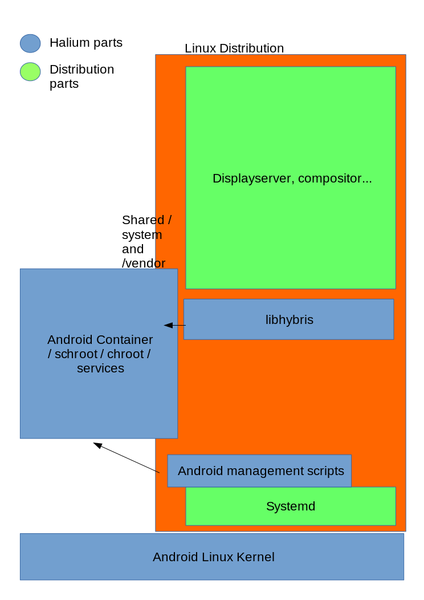

Planning
========

Linux kernel + Android + Libhybris common basel
-----------------------------------------------

Introduction
^^^^^^^^^^^^

Overall idea is, This stack includes,

* Linux kernel
* Android HAL
* Sensors
* Camera
* RILd
* Libhybris
* Android HAL interfaces like Audioflingerglue and droidmedia
* Build system and scripts
* GPS - AGPS from Mozilla
* Pulseaudio
* Media codecs
* oFono
* Way to distribute updates and images (way to install) (that's debatable)
* Systemd? (Upstart can handle user-level service initialization: See Ubuntu Touch)

This stack doesn't include the,

* Qt
* No Qt would be best, most platforms are very strict on the version they depend on
* Wayland
* KWin hwcomposer platform
* Plasma
* Unity
* Mir
* Lipstick
* Gecko
* Applications
* ``....``

Action Points
^^^^^^^^^^^^^

* See if there are any conflicting requirements and how best to resolve them. For eg. Ubuntu touch needs apparmor patches in kernel, while Sailfish doesn’t.
* Decide what the stack will contain and make a short summary of the whole thing.
* Decide how the lxc/container should be setup (img file like ubuntu or in rootfs like sailfish)
* Decide what will be the default method to accrue android, build our own or take vendors and modify that (both would be best here in my opinion)
* What infrastructure we will need for this? What are options?
* Fork `https://github.com/mickybart/gnulinux_support <https://github.com/mickybart/gnulinux_support>`_ / make pull requests?
* Find all kernel features systemd requires, maybe fork mer-kernel-check to automatically check kernel configs
* Fork `https://github.com/ubports/ubports-installer <https://github.com/ubports/ubports-installer>`_ for cross platform installations
* Fork ubp-5.1 && ubp-7.0
* Common support for Multirom :) YES PLEASE I don’t think Multirom is maintained anymore, but we can fork it can continue it ; There’s already a fork with active developers: `https://github.com/multirom-dev <https://github.com/multirom-dev>`_
* Please let’s move away from android recovery update method (it does not fit us) (Boot from sdcard using efidroid at least for testing, so write images to sdcards?)
* Document all the things! YES! We need that badly

REVIEW ONCE THEN MOVE UP - bshah
--------------------------------

What this base consists of? Or what is our “products”?
^^^^^^^^^^^^^^^^^^^^^^^^^^^^^^^^^^^^^^^^^^^^^^^^^^^^^^

* AOSP source tree (LineageOS)
* Collection of Device Repos (similar to Cyanogenmod)
* Prebuilt and ready-to-integrate android images
* Reference packaging of libhybris and co. for the distributions / developers
* Reference binary images of this stuff
* Tool to flash the images
* Documentation on how to integrate the AOSP base with Linux system (this is most important.. Basically everything we create needs to be documented from start)
* Common config system?

What I would expect from this is a minimal booting android with libhybris, and all the libhybris tests pass

What is the lifecycle of port?
^^^^^^^^^^^^^^^^^^^^^^^^^^^^^^

* Porting team decides upon target (or someone suggests it)
* We create android device and vendor tree or “fork” it from LineageOS/CM/AOSP/whatever
* Integrate our changes required for libhybris etc
* CI builds image and publishes them

Distributions (Plasma Mobile, UBports, Mer etc)
^^^^^^^^^^^^^^^^^^^^^^^^^^^^^^^^^^^^^^^^^^^^^^^

* Distributions picks up this new packaging if they are using our reference packaging for userspace (Linux) parts, otherwise they build their own packages.
* Along with rootfs generated from side of Distribution, they use the android IMG from the port lifecycle. (kernel depends on splitting / not splitting android and kernel)

The Stack - proposal
--------------------

The system is running on a android manufacturer linux kernel, IF the device is mainlined, it can run mainline linux kernel

(Initramfs?)

Systemd start’s up the system and the android HAL, which runs either in a schroot, container, or directly on the system.

Graphic output, camera and other sensors are managed by libhybris.

The linux distribution running with this stack can either use packages of libhybris etc. offered by us, if it’s compatible, or build it’s own

----

Some random links
^^^^^^^^^^^^^^^^^

* 
  `http://www.webos-ports.org/wiki/Halium_Considerations <http://www.webos-ports.org/wiki/Halium_Considerations>`_

* 
  `http://merproject.org/meetings/mer-meeting/2017/mer-meeting.2017-04-19-08.00.txt <http://merproject.org/meetings/mer-meeting/2017/mer-meeting.2017-04-19-08.00.txt>`_

* 
  `http://merproject.org/meetings/mer-meeting/2017/mer-meeting.2017-04-19-08.00.log.html <http://merproject.org/meetings/mer-meeting/2017/mer-meeting.2017-04-19-08.00.log.html>`_

Mer-meeting takeaway
^^^^^^^^^^^^^^^^^^^^

Jolla guys potentially interested but too early to commit to this. We need a proper proof-of-concept to show mer could run on top. Sailfish OS community devs of course anyone is welcome.

Jolla was concerned about how our things work with the ODMs way of things. This may not be a problem for community projects like ubports, plasma, et. al. but especially for Jolla since they’re dealing straight with the ODMs. Something to take into account when we build our infrastructure. We should make it as flexible as possible so that this would work with them also.

Initial halium creator script (locusf rambling)
-----------------------------------------------

#. Plug in phone, run adb, which pulls in needed binaries from /system
#. builds halium kernel + the boot selection (still wondering what this could be)
#. boot selector then fetches/runs the actual os inside some runtime (container/switch_root up to debate)

Halium kernel means both the actual kernel + middleware needed in order to have a common libhybris base from the running android system
